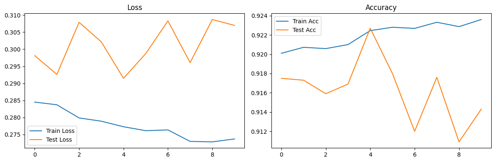

```python
import torch
```


```python
# Даталоадеры на основе датасетов MNIST
import torchvision
import torchvision.transforms as transforms
from torch.utils.data import Dataset, DataLoader


class MNISTDataset(Dataset):
    def __init__(self, train=True, transform=None):
        super().__init__()
        self.dataset = torchvision.datasets.MNIST(
            root='./data',
            train=train,
            download=True,
            transform=transform
        )

    def __len__(self):
        return len(self.dataset)

    def __getitem__(self, index):
        return self.dataset[index]


def get_mnist_loaders(batch_size=64):
    transform = transforms.Compose([
        transforms.ToTensor(),
        transforms.Normalize((0.1307,), (0.3081,))
    ])

    train_dataset = MNISTDataset(train=True, transform=transform)
    test_dataset = MNISTDataset(train=False, transform=transform)

    train_loader = DataLoader(train_dataset, batch_size=batch_size, shuffle=True)
    test_loader = DataLoader(test_dataset, batch_size=batch_size, shuffle=False)

    return train_loader, test_loader
```


```python
# класс FullyConnectedModel
import torch.nn as nn
import json


class FullyConnectedModel(nn.Module):
    def __init__(self, config_path=None, input_size=None, num_classes=None, **kwargs):
        super().__init__()

        if config_path:
            self.config = self.load_config(config_path)
        else:
            self.config = kwargs

        self.input_size = input_size or self.config.get('input_size', 784)
        self.num_classes = num_classes or self.config.get('num_classes', 10)

        self.name: str = None
        self.layers = self._build_layers()

    def load_config(self, config_path):
        """Загружает конфигурацию из JSON файла"""
        with open(config_path, 'r') as f:
            return json.load(f)

    def _build_layers(self):
        """Строит слои модели, полученные из загруженной ранее конфигурации"""
        layers = []
        prev_size = self.input_size

        layer_config = self.config.get('layers', [])
        layers_amount = len(layer_config)
        if layers_amount <= 1:
          layers_prefix = 'layer'
        else:
          layers_prefix = 'layers'
        self.name = f'{layers_amount} {layers_prefix}'

        for layer_spec in layer_config:
            layer_type = layer_spec['type']

            if layer_type == 'linear':
                out_size = layer_spec['size']
                layers.append(nn.Linear(prev_size, out_size))
                prev_size = out_size

            elif layer_type == 'relu':
                layers.append(nn.ReLU())

            elif layer_type == 'sigmoid':
                layers.append(nn.Sigmoid())

            elif layer_type == 'tanh':
                layers.append(nn.Tanh())

            elif layer_type == 'dropout':
                rate = layer_spec.get('rate', 0.5)
                layers.append(nn.Dropout(rate))

            elif layer_type == 'batch_norm':
                layers.append(nn.BatchNorm1d(prev_size))

            elif layer_type == 'layer_norm':
                layers.append(nn.LayerNorm(prev_size))

        layers.append(nn.Linear(prev_size, self.num_classes))
        return nn.Sequential(*layers)

    def forward(self, x):
        x = x.view(x.size(0), -1)
        return self.layers(x)


def create_model_from_config(config_path, input_size=None, num_classes=None):
    """Создает модель из JSON конфигурации"""
    return FullyConnectedModel(config_path, input_size, num_classes)
```


```python
# trainer
import torch.optim as optim
from tqdm import tqdm


def run_epoch(model, data_loader, criterion, optimizer=None, device='cpu', is_test=False, l2_alpha=0.001):
    if is_test:
        model.eval()
    else:
        model.train()

    total_loss = 0
    correct = 0
    total = 0

    for batch_idx, (data, target) in enumerate(data_loader):
        data, target = data.to(device), target.to(device)

        if not is_test and optimizer is not None:
            optimizer.zero_grad()

        output = model(data)
        loss = criterion(output, target)

        if not is_test and optimizer is not None:
            loss.backward()
            optimizer.step()

        total_loss += loss.item()
        pred = output.argmax(dim=1, keepdim=True)
        correct += pred.eq(target.view_as(pred)).sum().item()
        total += target.size(0)

    return total_loss / len(data_loader), correct / total


def train_model(model, train_loader, test_loader, epochs=10, lr=0.001, device='cpu'):
    criterion = nn.CrossEntropyLoss()
    optimizer = optim.Adam(model.parameters(), lr=lr)

    train_losses, train_accs = [], []
    test_losses, test_accs = [], []

    for epoch in tqdm(range(epochs)):
        train_loss, train_acc = run_epoch(model, train_loader, criterion, optimizer, device, is_test=False)
        test_loss, test_acc = run_epoch(model, test_loader, criterion, None, device, is_test=True)

        train_losses.append(train_loss)
        train_accs.append(train_acc)
        test_losses.append(test_loss)
        test_accs.append(test_acc)

    return {
        'train_losses': train_losses,
        'train_accs': train_accs,
        'test_losses': test_losses,
        'test_accs': test_accs
    }

```


```python
# utils
import torch
import matplotlib.pyplot as plt
import os

def plot_training_history(history):
    """Визуализирует историю обучения"""
    fig, (ax1, ax2) = plt.subplots(1, 2, figsize=(12, 4))

    ax1.plot(history['train_losses'], label='Train Loss')
    ax1.plot(history['test_losses'], label='Test Loss')
    ax1.set_title('Loss')
    ax1.legend()

    ax2.plot(history['train_accs'], label='Train Acc')
    ax2.plot(history['test_accs'], label='Test Acc')
    ax2.set_title('Accuracy')
    ax2.legend()

    plt.tight_layout()
    plt.show()


def count_parameters(model):
    """Подсчитывает количество параметров модели"""
    return sum(p.numel() for p in model.parameters() if p.requires_grad)


def save_model(
        path: str,
        model: torch.nn.Module,
        optimizer: torch.optim.Optimizer,
        epoch: int,
        best_test_loss: float,
        best_test_acc: float
    ):
    state_dict = {
        'model': model.state_dict(),
        'optimizer': optimizer.state_dict(),
        'epoch': epoch,
        'best_test_loss': best_test_loss,
        'best_test_acc': best_test_acc
    }
    os.makedirs(os.path.dirname(path), exist_ok=True)
    torch.save(state_dict, path)


def load_model(path: str, model: torch.nn.Module, optimizer: torch.optim.Optimizer):
    state_dict = torch.load(path)
    model.load_state_dict(state_dict['model'])
    optimizer.load_state_dict(state_dict['optimizer'])
    return state_dict['epoch'], state_dict['best_test_loss'], state_dict['best_test_acc']
```

# 1.1 Сравнение моделей разной глубины (15 баллов)


```python
# Создайте и обучите модели с различным количеством слоев:

# - 1 слой (линейный классификатор)
config_1layer = {
    "input_size": 784,
    "num_classes": 10,
    "layers": []}
model_1layer = FullyConnectedModel(**config_1layer)

# - 2 слоя (1 скрытый)
config_2layers = {
    "input_size": 784,
    "num_classes": 10,
    "layers": [{"type": "linear", "size": 512}]}
model_2layers = FullyConnectedModel(**config_2layers)

# - 3 слоя (2 скрытых)
config_3layers = {
    "input_size": 784,
    "num_classes": 10,
    "layers": [{"type": "linear", "size": 512},
               {'type': 'linear', 'size': 256},
               {'type': 'relu'}]}
model_3layers = FullyConnectedModel(**config_3layers)

# - 5 слоев (4 скрытых)
config_5layers = {
    "input_size": 784,
    "num_classes": 10,
    "layers": [
        {"type": "linear", "size": 512},
        {"type": "relu"},
        {"type": "linear", "size": 512},
        {"type": "relu"},
        {"type": "linear", "size": 256},
        {"type": "relu"},
        {"type": "linear", "size": 128},
        {"type": "relu"}
    ]
}
model_5layers = FullyConnectedModel(**config_5layers)

# - 7 слоев (6 скрытых)
config_7layers = {
    "input_size": 784,
    "num_classes": 10,
    "layers": [
        {"type": "linear", "size": 512},
        {"type": "relu"},
        {"type": "linear", "size": 400},
        {"type": "relu"},
        {"type": "linear", "size": 300},
        {"type": "relu"},
        {"type": "linear", "size": 256},
        {"type": "relu"},
        {"type": "linear", "size": 256},
        {"type": "relu"},
        {"type": "linear", "size": 128},
        {"type": "relu"}
    ]
}
model_7layers = FullyConnectedModel(**config_7layers)

```


```python
def get_models_accuracy(*model):
  loss_accuracies = {}
  models = {}
  for mod in model:
    models[mod.name] = mod

  train_loader, test_loader = get_mnist_loaders()
  device = torch.device('cuda')

  for model_name in models.keys():
      model = models[model_name]
      model = model.to(device)
      loss_accuracies[model_name] = train_model(model, train_loader, test_loader, epochs=10, device=device)
      # print(loss_accs[model_name])
  return loss_accuracies, device, (train_loader, test_loader)
```


```python
# Сохраним полученные результаты
loss_accs, device, loaders = get_models_accuracy(model_1layer, model_2layers, model_3layers, model_5layers, model_7layers)
torch.save(loss_accs, 'loss_accuracy.pt')
```

    100%|██████████| 10/10 [02:24<00:00, 14.42s/it]
    100%|██████████| 10/10 [02:25<00:00, 14.53s/it]
    100%|██████████| 10/10 [02:28<00:00, 14.84s/it]
    100%|██████████| 10/10 [02:32<00:00, 15.26s/it]
    100%|██████████| 10/10 [02:37<00:00, 15.75s/it]
    


```python
# Нарисуем графики полученных резульаттов
import matplotlib.pyplot as plt
fig, ax = plt.subplots(2,2, figsize=(13, 7))

plot_names = {(0, 0): 'Train Losses',
              (0, 1): 'Train Accuracy',
              (1, 0): 'Test Losses',
              (1, 1): 'Test Accuracy'}

for k, values in loss_accs.items():
    for i, val in enumerate(values.values()):
        nrow = i // 2
        ncol = i % 2
        ax[nrow, ncol].plot(val, label=k)
        ax[nrow, ncol].legend()
        ax[nrow, ncol].grid(True)
        ax[nrow, ncol].set_xticks(range(10))
        ax[nrow, ncol].set_title(plot_names[(nrow, ncol)])

for key in loss_accs.keys():
  plot_training_history(loss_accs[key])
plt.show()
```


    

    


    

    


    

    


    

    


    

    


    

    


Для каждого варианта:
- Сравните точность на train и test
> Точность на test всегда немного ниже/наравне, чем на train, потому что модель "запоминает" значения из train выборки. Только при первых эпохах test показал результат немного лучше, опять же из-за "запоминания"
- Визуализируйте кривые обучения
> Графики на тестовых выборках более ломанные, чем на тренировочной. Ещё одно проявление "запоминания" значений признаков
- Проанализируйте время обучения
> Чем больше слоев, тем больше изменяющихся параметров => Время обучения увеличивается

## 1.2 Анализ переобучения (15 баллов)


```python
# Исследуйте влияние глубины на переобучение:
# Продолжим обучение модели с 3 слоями на 42 эпохи:
model = model_3layers.to(device)
total_epochs42_loss_accr = train_model(model, loaders[0], loaders[1], epochs=42, device=device)

```

    100%|██████████| 42/42 [10:28<00:00, 14.96s/it]
    


```python
# Сохраним полученные значения losses/accuracy
torch.save(total_epochs42_loss_accr, 'loss42.pt')
```


```python
# - Постройте графики train/test accuracy по эпохам
for key, val in total_epochs42_loss_accr.items():
    plt.plot(val, label=k)
plt.legend(total_epochs42_loss_accr.keys())
plt.grid(True)
plt.show()
```


    

    


```python
# - Добавьте Dropout и BatchNorm, сравните результаты
configDropBatchNorm3layers ={
    "input_size": 784,
    "num_classes": 10,
    "layers": [{"type": "linear", "size": 512},
               {'type': 'dropout', 'rate': 0.3},
               {'type': 'batch_norm'},
               {'type': 'linear', 'size': 256},
               {'type': 'relu'}]}
model3layersDropNorm = FullyConnectedModel(**configDropBatchNorm3layers)
model3layersDropNorm = model3layersDropNorm.to(device)
loss_accr_with_DropNorm_42epochs = train_model(model3layersDropNorm, loaders[0], loaders[1], epochs=42, device=device)

```

    100%|██████████| 42/42 [10:39<00:00, 15.23s/it]
    


```python
for key, val in loss_accr_with_DropNorm_42epochs.items():
    plt.plot(val, label=k)
plt.legend(total_epochs42_loss_accr.keys())
plt.grid(True)
plt.show()
```


    

    


- Проанализируйте, когда начинается переобучение
> У модели с 3 слоями график по прямой линии тренда после 10 эпохи **test_losses** начинает подниматься вверх, что говорит о начале переобучении
>
> У модели с Dropout and BatchNorm график **test_losses** имеет схожую линию тренда, но она гораздо под меньшим углом (едва ли больше пары градусов)
- Определите оптимальную глубину для каждого датасета
> Для обычной с 3 слоями - около 10-15, с Dropout/BatchNorm - около 30-40, далее **test_losses** начинают более видимо увеличиваться и "искривляться"
