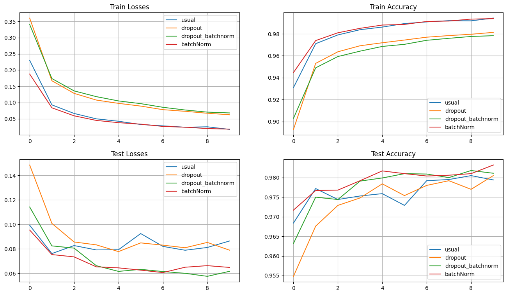

```python
import torch
```


```python
# Создадим даталоадеры на основе датасетов MNIST
import torchvision
import torchvision.transforms as transforms
from torch.utils.data import Dataset, DataLoader


class MNISTDataset(Dataset):
    def __init__(self, train=True, transform=None):
        super().__init__()
        self.dataset = torchvision.datasets.MNIST(
            root='./data',
            train=train,
            download=True,
            transform=transform
        )

    def __len__(self):
        return len(self.dataset)

    def __getitem__(self, index):
        return self.dataset[index]


def get_mnist_loaders(batch_size=64):
    transform = transforms.Compose([
        transforms.ToTensor(),
        transforms.Normalize((0.1307,), (0.3081,))
    ])

    train_dataset = MNISTDataset(train=True, transform=transform)
    test_dataset = MNISTDataset(train=False, transform=transform)

    train_loader = DataLoader(train_dataset, batch_size=batch_size, shuffle=True)
    test_loader = DataLoader(test_dataset, batch_size=batch_size, shuffle=False)

    return train_loader, test_loader
```


```python
# класс FullyConnectedModel
import torch.nn as nn
import json


class FullyConnectedModel(nn.Module):
    def __init__(self, config_path=None, input_size=None, num_classes=None, **kwargs):
        super().__init__()

        if config_path:
            self.config = self.load_config(config_path)
        else:
            self.config = kwargs

        self.input_size = input_size or self.config.get('input_size', 784)
        self.num_classes = num_classes or self.config.get('num_classes', 10)

        self.name: str = None
        self.layers = self._build_layers()

    def load_config(self, config_path):
        """Загружает конфигурацию из JSON файла"""
        with open(config_path, 'r') as f:
            return json.load(f)

    def _build_layers(self):
        """Строит слои модели, полученные из загруженной ранее конфигурации"""
        layers = []
        prev_size = self.input_size

        layer_config = self.config.get('layers', [])
        layers_amount = len(layer_config)
        if layers_amount <= 1:
          layers_prefix = 'layer'
        else:
          layers_prefix = 'layers'
        self.name = f'{layers_amount} {layers_prefix}'

        for layer_spec in layer_config:
            layer_type = layer_spec['type']

            if layer_type == 'linear':
                out_size = layer_spec['size']
                layers.append(nn.Linear(prev_size, out_size))
                prev_size = out_size

            elif layer_type == 'relu':
                layers.append(nn.ReLU())

            elif layer_type == 'sigmoid':
                layers.append(nn.Sigmoid())

            elif layer_type == 'tanh':
                layers.append(nn.Tanh())

            elif layer_type == 'dropout':
                rate = layer_spec.get('rate', 0.5)
                layers.append(nn.Dropout(rate))

            elif layer_type == 'batch_norm':
                layers.append(nn.BatchNorm1d(prev_size))

            elif layer_type == 'layer_norm':
                layers.append(nn.LayerNorm(prev_size))

        layers.append(nn.Linear(prev_size, self.num_classes))
        return nn.Sequential(*layers)

    def forward(self, x):
        x = x.view(x.size(0), -1)
        return self.layers(x)


def create_model_from_config(config_path, input_size=None, num_classes=None):
    """Создает модель из JSON конфигурации"""
    return FullyConnectedModel(config_path, input_size, num_classes)
```


```python
# trainer
import torch.optim as optim
from tqdm import tqdm


def run_epoch(model, data_loader, criterion, optimizer=None, device='cpu', is_test=False, l2_alpha=0.001):
    if is_test:
        model.eval()
    else:
        model.train()

    total_loss = 0
    correct = 0
    total = 0

    for batch_idx, (data, target) in enumerate(data_loader):
        data, target = data.to(device), target.to(device)

        if not is_test and optimizer is not None:
            optimizer.zero_grad()

        output = model(data)
        loss = criterion(output, target)

        if not is_test and optimizer is not None:
            loss.backward()
            optimizer.step()

        total_loss += loss.item()
        pred = output.argmax(dim=1, keepdim=True)
        correct += pred.eq(target.view_as(pred)).sum().item()
        total += target.size(0)

    return total_loss / len(data_loader), correct / total


def train_model(model, train_loader, test_loader, epochs=10, lr=0.001, device='cpu'):
    criterion = nn.CrossEntropyLoss()
    optimizer = optim.Adam(model.parameters(), lr=lr)

    train_losses, train_accs = [], []
    test_losses, test_accs = [], []

    for epoch in tqdm(range(epochs)):
        train_loss, train_acc = run_epoch(model, train_loader, criterion, optimizer, device, is_test=False)
        test_loss, test_acc = run_epoch(model, test_loader, criterion, None, device, is_test=True)

        train_losses.append(train_loss)
        train_accs.append(train_acc)
        test_losses.append(test_loss)
        test_accs.append(test_acc)

    return {
        'train_losses': train_losses,
        'train_accs': train_accs,
        'test_losses': test_losses,
        'test_accs': test_accs
    }

```


```python
# utils
import torch
import matplotlib.pyplot as plt
import os

def plot_training_history(history):
    """Визуализирует историю обучения"""
    fig, (ax1, ax2) = plt.subplots(1, 2, figsize=(12, 4))

    ax1.plot(history['train_losses'], label='Train Loss')
    ax1.plot(history['test_losses'], label='Test Loss')
    ax1.set_title('Loss')
    ax1.legend()

    ax2.plot(history['train_accs'], label='Train Acc')
    ax2.plot(history['test_accs'], label='Test Acc')
    ax2.set_title('Accuracy')
    ax2.legend()

    plt.tight_layout()
    plt.show()


def count_parameters(model):
    """Подсчитывает количество параметров модели"""
    return sum(p.numel() for p in model.parameters() if p.requires_grad)


def save_model(
        path: str,
        model: torch.nn.Module,
        optimizer: torch.optim.Optimizer,
        epoch: int,
        best_test_loss: float,
        best_test_acc: float
    ):
    state_dict = {
        'model': model.state_dict(),
        'optimizer': optimizer.state_dict(),
        'epoch': epoch,
        'best_test_loss': best_test_loss,
        'best_test_acc': best_test_acc
    }
    os.makedirs(os.path.dirname(path), exist_ok=True)
    torch.save(state_dict, path)


def load_model(path: str, model: torch.nn.Module, optimizer: torch.optim.Optimizer):
    state_dict = torch.load(path)
    model.load_state_dict(state_dict['model'])
    optimizer.load_state_dict(state_dict['optimizer'])
    return state_dict['epoch'], state_dict['best_test_loss'], state_dict['best_test_acc']
```

# Задание 3: Эксперименты с регуляризацией (25 баллов)


## 3.1 Сравнение техник регуляризации (15 баллов)


```python
# Исследуйте различные техники регуляризации:
# Для каждого варианта:
# - Используйте одинаковую архитектуру

# - Без регуляризации
usual = {
    "input_size": 784,
    "num_classes": 10,
    "layers": [{"type": "linear", "size": 256},
               {'type': 'relu'},
               {'type': 'linear', 'size': 128},
               {'type': 'relu'},
               {'type':' linear', 'size': 64}]}

usual_model = FullyConnectedModel(**usual)

# - Только Dropout (разные коэффициенты: 0.1, 0.3, 0.5)
only_dropout = {
    "input_size": 784,
    "num_classes": 10,
    "layers": [{"type": "linear", "size": 256},
               {'type': 'dropout', 'rate': 0.1},
               {'type': 'relu'},
               {'type': 'linear', 'size': 128},
               {'type': 'dropout', 'rate': 0.3},
               {'type': 'relu'},
               {'type':' linear', 'size': 64},
               {'type': 'dropout', 'rate': 0.5}]}
dropout_model = FullyConnectedModel(**only_dropout)

# - Только BatchNorm
only_batchNorm = {
    "input_size": 784,
    "num_classes": 10,
    "layers": [{"type": "linear", "size": 256},
               {'type': 'batch_norm'},
               {'type': 'relu'},
               {'type': 'linear', 'size': 128},
               {'type': 'batch_norm'},
               {'type': 'relu'},
               {'type':' linear', 'size': 64},
               {'type': 'batch_norm'}]}
batchNorm_model = FullyConnectedModel(**only_batchNorm)

# - Dropout + BatchNorm
dropout_batchNorm =  {
    "input_size": 784,
    "num_classes": 10,
    "layers": [{"type": "linear", "size": 256},
               {'type': 'batch_norm'},
               {'type': 'dropout', 'rate': 0.1},
               {'type': 'relu'},
               {'type': 'linear', 'size': 128},
               {'type': 'batch_norm'},
               {'type': 'dropout', 'rate': 0.3},
               {'type': 'relu'},
               {'type':' linear', 'size': 64},
               {'type': 'batch_norm'},
               {'type': 'dropout', 'rate': 0.5}]}
dropbatch_model = FullyConnectedModel(**dropout_batchNorm)

search_models = {
    'usual' : usual_model,
    'dropout': dropout_model,
    'dropout_batchnorm': dropbatch_model,
    'batchNorm' : batchNorm_model}
```


```python
device = torch.device('cuda')
train_loader, test_loader = get_mnist_loaders()
search_loss = {}
for model_name in search_models.keys():
    model = search_models[model_name]
    model = model.to(device)
    search_loss[model_name] = train_model(model, train_loader, test_loader, epochs=10, device=device)
    print(search_loss[model_name])


```

    100%|██████████| 10/10 [02:35<00:00, 15.56s/it]
    

    {'train_losses': [0.22989418637603204, 0.09278300783332827, 0.06638437463417411, 0.04977038037962715, 0.0423700523914954, 0.03229678889608328, 0.02814946588928726, 0.023798738062679424, 0.02523025502017387, 0.017199502432150324], 'train_accs': [0.93095, 0.9710166666666666, 0.9790166666666666, 0.9837833333333333, 0.9861666666666666, 0.9893666666666666, 0.9909, 0.9920333333333333, 0.9918833333333333, 0.99435], 'test_losses': [0.0992633023100555, 0.07614146323543143, 0.08267336587763056, 0.0791212198486519, 0.0792722483669202, 0.09246787624476041, 0.08199682633228189, 0.07884603669990495, 0.08112253291320212, 0.08640556546194435], 'test_accs': [0.9684, 0.9772, 0.9744, 0.9753, 0.9759, 0.9729, 0.9792, 0.9795, 0.9805, 0.9794]}
    

    100%|██████████| 10/10 [02:37<00:00, 15.73s/it]
    

    {'train_losses': [0.36012355127592266, 0.16715610399047956, 0.12827702676966737, 0.10765164373303528, 0.09747169672974201, 0.08907586623872839, 0.0780744441920943, 0.07298554000712788, 0.06700612615750753, 0.06240328490860196], 'train_accs': [0.8928333333333334, 0.9530666666666666, 0.9636333333333333, 0.9691333333333333, 0.9718666666666667, 0.97435, 0.97695, 0.9784, 0.9796166666666667, 0.98135], 'test_losses': [0.1484614778050536, 0.1007917208240125, 0.08560544719994083, 0.08326208147224577, 0.07774628481714968, 0.08485528977981648, 0.08300524716596962, 0.08090105138548072, 0.08524883652605304, 0.07891950744267201], 'test_accs': [0.9548, 0.9676, 0.9729, 0.9748, 0.9784, 0.9754, 0.978, 0.9792, 0.977, 0.9805]}
    

    100%|██████████| 10/10 [02:41<00:00, 16.12s/it]
    

    {'train_losses': [0.34057791685975436, 0.17389773055394767, 0.13591458468533146, 0.11819288788486455, 0.10496331475077392, 0.09661077378965072, 0.08533263716922164, 0.07701307968365581, 0.07045561259588612, 0.06799589239705259], 'train_accs': [0.9029166666666667, 0.949, 0.9593, 0.9642166666666667, 0.9685166666666667, 0.9704333333333334, 0.9741166666666666, 0.9759166666666667, 0.9776, 0.9783166666666666], 'test_losses': [0.1141938899783121, 0.08241129494298124, 0.08058018906369722, 0.06625026665352861, 0.06157574169021686, 0.06324144873212338, 0.061455407516463036, 0.059998061671185904, 0.057543853927060934, 0.06164068542090666], 'test_accs': [0.9632, 0.975, 0.9744, 0.9791, 0.9799, 0.981, 0.9809, 0.98, 0.9818, 0.9811]}
    

    100%|██████████| 10/10 [02:39<00:00, 15.99s/it]

    {'train_losses': [0.18777451237171158, 0.08378274969980995, 0.059103955636356974, 0.044897002931649506, 0.03798319195865838, 0.033405320236033924, 0.0263500163900797, 0.024066424830884326, 0.01985279218074548, 0.01815214897039595], 'train_accs': [0.9447, 0.97385, 0.9809666666666667, 0.9850333333333333, 0.9880166666666667, 0.9886, 0.9912833333333333, 0.9916833333333334, 0.99345, 0.99385], 'test_losses': [0.09535475561816459, 0.07531503143877527, 0.07344038506664312, 0.06531669819489519, 0.06445828532459175, 0.06259520335467184, 0.06060423157233941, 0.06497812308230182, 0.06626596140087053, 0.06481395239050262], 'test_accs': [0.9717, 0.9767, 0.9768, 0.9792, 0.9817, 0.981, 0.9804, 0.9806, 0.981, 0.9832]}
    

    
    


```python
# Сравните финальную точность
fig, ax = plt.subplots(2,2, figsize=(16, 9))

for k, values in search_loss.items():
    for i, val in enumerate(values.values()):
        nrow = i // 2
        ncol = i % 2
        ax[nrow, ncol].plot(val, label=k)
        ax[nrow, ncol].legend()
        ax[nrow, ncol].grid(True)

ax[0, 0].set_title('Train Losses')
ax[0, 1].set_title('Train Accuracy')
ax[1, 0].set_title('Test Losses')
ax[1, 1].set_title('Test Accuracy')

plt.show()
```


    

    


- Проанализируйте стабильность обучения
> Как мы видим, самые низкие потери и высокие значения на тренировочных данных (причем ведет себя очень стабильно( - usual layer. Она же дает самые высокие потери и низкую точность относительно других моделей на тестовой ввыборке (вела себя нестабильно)4
>
> Dropout дает высокие и нестабильные потери, но стабильную точность
>
> Самыми лучшими и стабильными относительно других на тестовой выборке были **Dropout + BatchNorm** и обычный **BatchNorm**. **Dropout + BatchNorm** был самым худшим по потерям и accuracy на train выборке, но вырвался вперед на test выборке, показав практически ***такой же результат***, как и на train выборке

