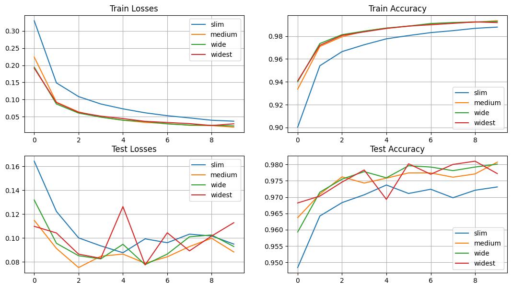
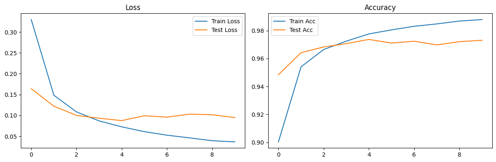
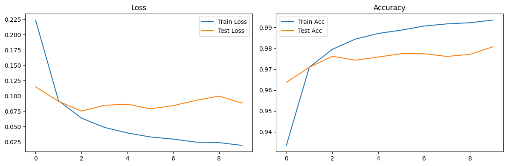
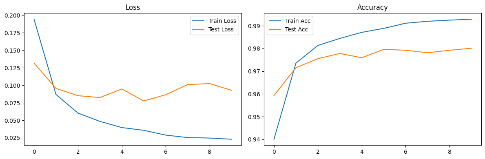
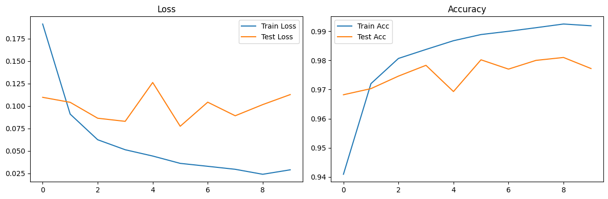

```python
import torch
```


```python
# Даталоадеры на основе датасетов MNIST
import torchvision
import torchvision.transforms as transforms
from torch.utils.data import Dataset, DataLoader


class MNISTDataset(Dataset):
    def __init__(self, train=True, transform=None):
        super().__init__()
        self.dataset = torchvision.datasets.MNIST(
            root='./data',
            train=train,
            download=True,
            transform=transform
        )

    def __len__(self):
        return len(self.dataset)

    def __getitem__(self, index):
        return self.dataset[index]


def get_mnist_loaders(batch_size=64):
    transform = transforms.Compose([
        transforms.ToTensor(),
        transforms.Normalize((0.1307,), (0.3081,))
    ])

    train_dataset = MNISTDataset(train=True, transform=transform)
    test_dataset = MNISTDataset(train=False, transform=transform)

    train_loader = DataLoader(train_dataset, batch_size=batch_size, shuffle=True)
    test_loader = DataLoader(test_dataset, batch_size=batch_size, shuffle=False)

    return train_loader, test_loader
```


```python
# класс FullyConnectedModel
import torch.nn as nn
import json


class FullyConnectedModel(nn.Module):
    def __init__(self, config_path=None, input_size=None, num_classes=None, **kwargs):
        super().__init__()

        if config_path:
            self.config = self.load_config(config_path)
        else:
            self.config = kwargs

        self.input_size = input_size or self.config.get('input_size', 784)
        self.num_classes = num_classes or self.config.get('num_classes', 10)

        self.name: str = None
        self.layers = self._build_layers()

    def load_config(self, config_path):
        """Загружает конфигурацию из JSON файла"""
        with open(config_path, 'r') as f:
            return json.load(f)

    def _build_layers(self):
        """Строит слои модели, полученные из загруженной ранее конфигурации"""
        layers = []
        prev_size = self.input_size

        layer_config = self.config.get('layers', [])
        layers_amount = len(layer_config)
        if layers_amount <= 1:
          layers_prefix = 'layer'
        else:
          layers_prefix = 'layers'
        self.name = f'{layers_amount} {layers_prefix}'

        for layer_spec in layer_config:
            layer_type = layer_spec['type']

            if layer_type == 'linear':
                out_size = layer_spec['size']
                layers.append(nn.Linear(prev_size, out_size))
                prev_size = out_size

            elif layer_type == 'relu':
                layers.append(nn.ReLU())

            elif layer_type == 'sigmoid':
                layers.append(nn.Sigmoid())

            elif layer_type == 'tanh':
                layers.append(nn.Tanh())

            elif layer_type == 'dropout':
                rate = layer_spec.get('rate', 0.5)
                layers.append(nn.Dropout(rate))

            elif layer_type == 'batch_norm':
                layers.append(nn.BatchNorm1d(prev_size))

            elif layer_type == 'layer_norm':
                layers.append(nn.LayerNorm(prev_size))

        layers.append(nn.Linear(prev_size, self.num_classes))
        return nn.Sequential(*layers)

    def forward(self, x):
        x = x.view(x.size(0), -1)
        return self.layers(x)


def create_model_from_config(config_path, input_size=None, num_classes=None):
    """Создает модель из JSON конфигурации"""
    return FullyConnectedModel(config_path, input_size, num_classes)
```


```python
# trainer
import torch.optim as optim
from tqdm import tqdm


def run_epoch(model, data_loader, criterion, optimizer=None, device='cpu', is_test=False, l2_alpha=0.001):
    if is_test:
        model.eval()
    else:
        model.train()

    total_loss = 0
    correct = 0
    total = 0

    for batch_idx, (data, target) in enumerate(data_loader):
        data, target = data.to(device), target.to(device)

        if not is_test and optimizer is not None:
            optimizer.zero_grad()

        output = model(data)
        loss = criterion(output, target)

        if not is_test and optimizer is not None:
            loss.backward()
            optimizer.step()

        total_loss += loss.item()
        pred = output.argmax(dim=1, keepdim=True)
        correct += pred.eq(target.view_as(pred)).sum().item()
        total += target.size(0)

    return total_loss / len(data_loader), correct / total


def train_model(model, train_loader, test_loader, epochs=10, lr=0.001, device='cpu'):
    criterion = nn.CrossEntropyLoss()
    optimizer = optim.Adam(model.parameters(), lr=lr)

    train_losses, train_accs = [], []
    test_losses, test_accs = [], []

    for epoch in tqdm(range(epochs)):
        train_loss, train_acc = run_epoch(model, train_loader, criterion, optimizer, device, is_test=False)
        test_loss, test_acc = run_epoch(model, test_loader, criterion, None, device, is_test=True)

        train_losses.append(train_loss)
        train_accs.append(train_acc)
        test_losses.append(test_loss)
        test_accs.append(test_acc)

    return {
        'train_losses': train_losses,
        'train_accs': train_accs,
        'test_losses': test_losses,
        'test_accs': test_accs
    }

```


```python
# utils
import torch
import matplotlib.pyplot as plt
import os

def plot_training_history(history):
    """Визуализирует историю обучения"""
    fig, (ax1, ax2) = plt.subplots(1, 2, figsize=(12, 4))

    ax1.plot(history['train_losses'], label='Train Loss')
    ax1.plot(history['test_losses'], label='Test Loss')
    ax1.set_title('Loss')
    ax1.legend()

    ax2.plot(history['train_accs'], label='Train Acc')
    ax2.plot(history['test_accs'], label='Test Acc')
    ax2.set_title('Accuracy')
    ax2.legend()

    plt.tight_layout()
    plt.show()


def count_parameters(model):
    """Подсчитывает количество параметров модели"""
    return sum(p.numel() for p in model.parameters() if p.requires_grad)


def save_model(
        path: str,
        model: torch.nn.Module,
        optimizer: torch.optim.Optimizer,
        epoch: int,
        best_test_loss: float,
        best_test_acc: float
    ):
    state_dict = {
        'model': model.state_dict(),
        'optimizer': optimizer.state_dict(),
        'epoch': epoch,
        'best_test_loss': best_test_loss,
        'best_test_acc': best_test_acc
    }
    os.makedirs(os.path.dirname(path), True)
    torch.save(state_dict, path)


def load_model(path: str, model: torch.nn.Module, optimizer: torch.optim.Optimizer):
    state_dict = torch.load(path)
    model.load_state_dict(state_dict['model'])
    optimizer.load_state_dict(state_dict['optimizer'])
    return state_dict['epoch'], state_dict['best_test_loss'], state_dict['best_test_acc']
```

# Задание 2: Эксперименты с шириной сети (25 баллов)


## 2.1 Сравнение моделей разной ширины (15 баллов)


```python
# Создайте модели с различной шириной слоев:
# - Узкие слои: [64, 32, 16]
slim = {
    "input_size": 784,
    "num_classes": 10,
    "layers": [{"type": "linear", "size": 64},
               {'type': 'relu'},
               {'type': 'linear', 'size': 32},
               {'type': 'relu'},
               {'type':' linear', 'size': 16}]}

# - Средние слои: [256, 128, 64]
medium = {
    "input_size": 784,
    "num_classes": 10,
    "layers": [{"type": "linear", "size": 256},
               {'type': 'relu'},
               {'type': 'linear', 'size': 128},
               {'type': 'relu'},
               {'type':' linear', 'size': 64}]}

# - Широкие слои: [1024, 512, 256]
wide = {
    "input_size": 784,
    "num_classes": 10,
    "layers": [{"type": "linear", "size": 1024},
               {'type': 'relu'},
               {'type': 'linear', 'size': 512},
               {'type': 'relu'},
               {'type':' linear','size': 256}]}

# - Очень широкие слои: [2048, 1024, 512]
widest = {
    "input_size": 784,
    "num_classes": 10,
    "layers": [{"type": "linear", "size": 2048},
               {'type': 'relu'},
               {'type': 'linear', 'size': 1024},
               {'type': 'relu'},
               {'type':' linear','size': 512}]}


slim_model = FullyConnectedModel(**slim)
medium_model = FullyConnectedModel(**medium)
wide_model = FullyConnectedModel(**wide)
widest_model = FullyConnectedModel(**widest)

models_dict = {
    'slim':slim_model,
    'medium': medium_model,
    'wide': wide_model,
    'widest': widest_model
}
```


```python
import time
losses_many_layers = dict()
ep = 10
total_time = []
device = torch.device('cuda')
train_loader, test_loader = get_mnist_loaders()

for name in models_dict.keys():
    model = models_dict[name]
    model = model.to(device)
    start = time.time()
    losses_many_layers[name] = train_model(model, train_loader, test_loader, epochs=ep, device=device)
    tmp_time = time.time() - start
    total_time.append(tmp_time)
    print(f'{name} layer|  Total time: {tmp_time}')

torch.save(losses_many_layers, 'many_layers.pt')
```

    100%|██████████| 9.91M/9.91M [00:02<00:00, 4.61MB/s]
    100%|██████████| 28.9k/28.9k [00:00<00:00, 135kB/s]
    100%|██████████| 1.65M/1.65M [00:06<00:00, 247kB/s]
    100%|██████████| 4.54k/4.54k [00:00<00:00, 10.6MB/s]
    100%|██████████| 10/10 [02:30<00:00, 15.03s/it]
    

    slim layer|  Total time: 150.3351399898529
    

    100%|██████████| 10/10 [02:33<00:00, 15.35s/it]
    

    medium layer|  Total time: 153.50493955612183
    

    100%|██████████| 10/10 [02:29<00:00, 14.93s/it]
    

    wide layer|  Total time: 149.3413281440735
    

    100%|██████████| 10/10 [02:35<00:00, 15.55s/it]

    widest layer|  Total time: 155.47302198410034
    

    
    


```python
# - Проанализируйте количество параметров
def count_parameters(model):
    """Подсчитывает количество параметров модели"""
    return sum(p.numel() for p in model.parameters() if p.requires_grad)

for i, m in enumerate(models_dict.keys()):
    print(f'Model {m} layer: {count_parameters(models_dict[m])} parametrs. Time: {total_time[i]:.2f} s')

# - Сравните точность и время обучения
fig, ax = plt.subplots(2,2, figsize=(13, 7))

plot_names = {(0, 0): 'Train Losses',
              (0, 1): 'Train Accuracy',
              (1, 0): 'Test Losses',
              (1, 1): 'Test Accuracy'}

for k, values in losses_many_layers.items():
    for i, val in enumerate(values.values()):
        nrow = i // 2
        ncol = i % 2
        ax[nrow, ncol].plot(val, label=k)
        ax[nrow, ncol].legend()
        ax[nrow, ncol].grid(True)
        ax[nrow, ncol].set_title(plot_names[(nrow, ncol)])

# plt.show()
for key in losses_many_layers.keys():
    plot_training_history(losses_many_layers[key])
```

    Model slim layer: 52650 parametrs. Time: 150.34 s
    Model medium layer: 235146 parametrs. Time: 153.50 s
    Model wide layer: 1333770 parametrs. Time: 149.34 s
    Model widest layer: 3716106 parametrs. Time: 155.47 s
    


    

    


    

    


    

    


    

    


    

    


Здесь самая оптимальная **medium сеть**: всего 235146 параметров и достаточна стабильна.\
Losses/Accuracy примерно такое же, как и у *Wide, Widest моделей*

## 2.2 Оптимизация архитектуры (10 баллов)


```python
# Найдите оптимальную архитектуру:
# - Используйте grid search для поиска лучшей комбинации
# - Попробуйте различные схемы изменения ширины (расширение, сужение, постоянная)
# - Визуализируйте результаты в виде heatmap
```
